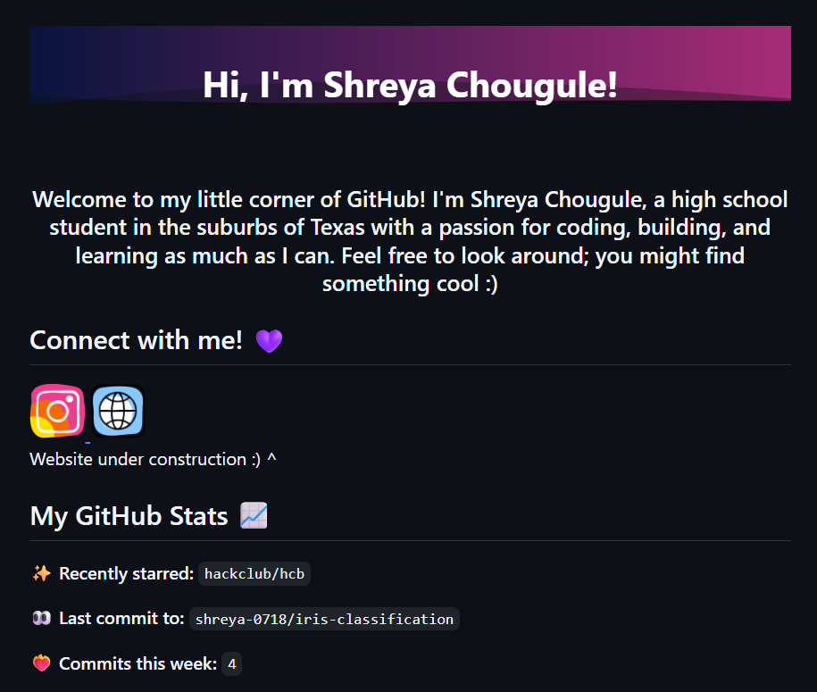

# README.md
## name of my project: shreya-0718-readme

Hello! This is my README file for my github profile. It includes an introduction about me, some github stats (using Octokit.js), and the tools I've learned or used! 

## How to use things from this:
- The headers and footers came from [kyechan99's capsule renderer](https://github.com/kyechan99/capsule-render?tab=readme-ov-file#how-to-use). I used the `fadeIn` animation and the `waving` type for the header, and a simple `waving` type for the footer.
- The stats are generated using [Octokit.js](https://github.com/octokit/octokit.js).
- The icons for the tools I used are from [Devicons](https://devicon.dev/). I used the icons from the `devicons` repository and added them to my README using the `` tag.

---

Here is a screenshot of my README file: 

